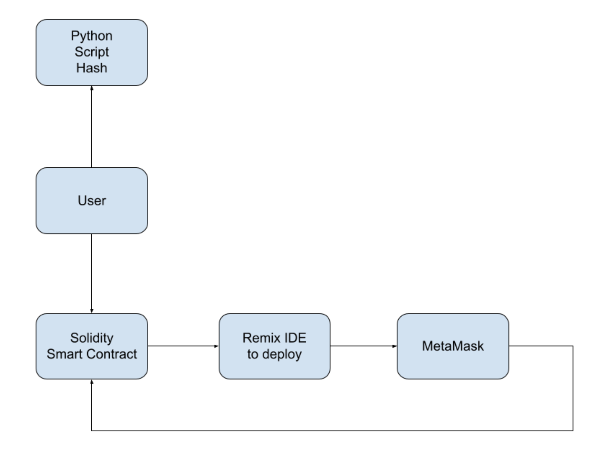

# Guess Which Hand? - Smart Contract Game

"Guess Which Hand?" is a smart contract game where a player and a computer pick a choice of 'Left' or 'Right. If the player picks the same move as the computer the player wins. If not, the player loses. 

This game is implemented using a smart contract within the Ethereum blockchain. When playing this game, the player will run first run a python script where they pick their move and a password; then is provided a key (combination of the move and password) and a hash of the key via SHA-256.

Once receiving the key & hash, the player will first input the hash value into the smart contract when making their move. Once ready to reveal the answer that the computer made, the player will have to input the key provided from the python script. The smart contract will hash this key via SHA-256 and verify that it is the same hash provided when the player made their move. 

## Installation & Setup

1. Clone the repository.
```bash
https://github.com/cameronlxu/GuessWhichHand.git
```

2.  on your browser (I used Chrome), and be log in.

3. Add ether in the account, either through a  or 

4. Open up the [Remix IDE](https://remix.ethereum.org/).

5. Import the `game.sol` script.

## Usage

1. Run the python script `generateMove.py`:
```bash
python3 generateMove.py
```

2. Enter a move "L" or "R", then enter a custom password:


3. Compile & deploy the smart contract on the Remix IDE. 

4. Regsiter your player:


5. Copy the hash from the python script results and paste it into the `gamePlay` function (including the quotes):


6. Copy the plaintext key from the python script and paste it into the `showAnswer` function (including the quotes):


7. Find out if you won or not!


## High Level Architecture



## Support

If there are any issues with this bot, please feel free to contact me at: cameron.lau@sjsu.edu!